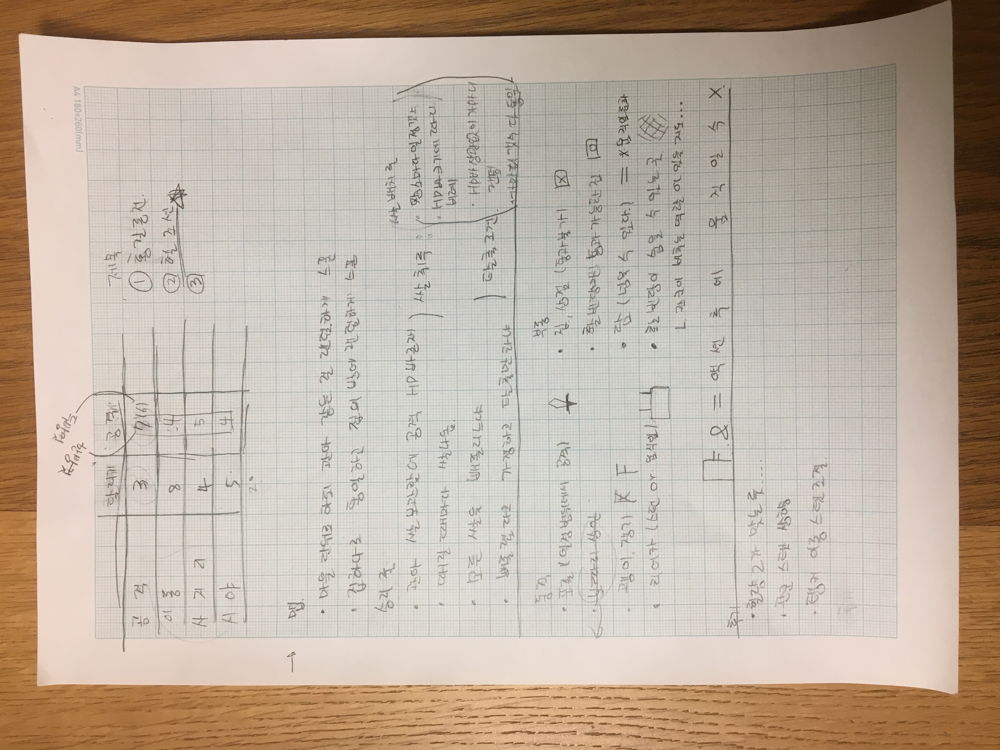
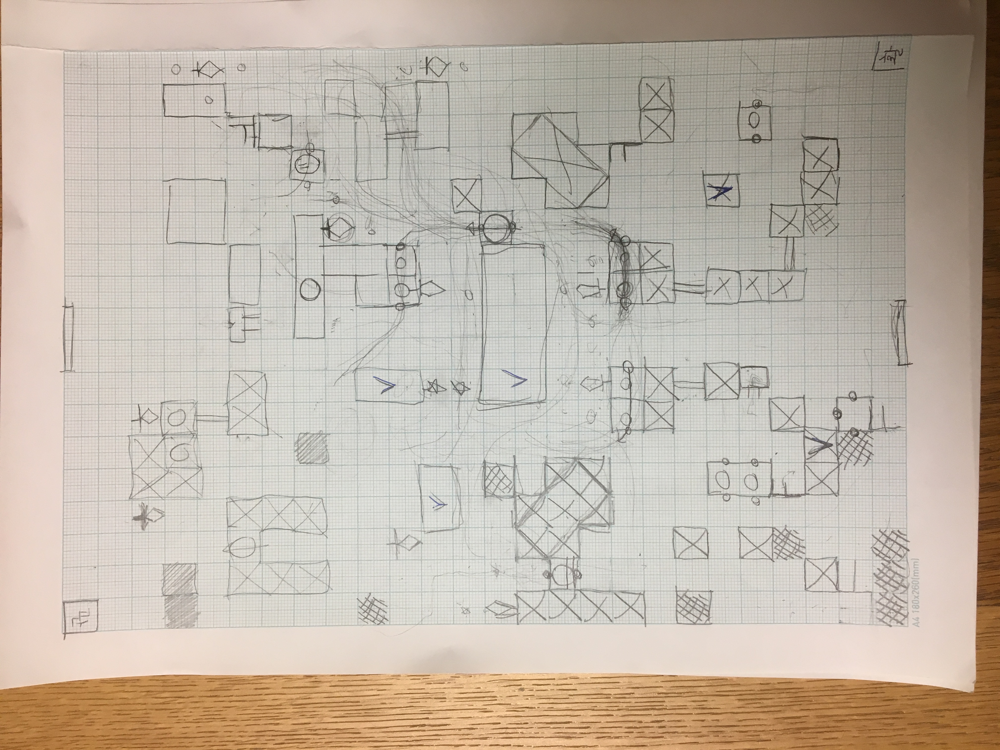

# 2018.11.16 회의록

- 맵에 대해

  - 맵의 크기
    - 마을 단위로 하되 관아 같은 보물 획득장소를 랜덤하게 스폰(선택)
    - 집하나로 통일하고 집의 방에 랜덤하게 보물 스폰
  - 장애물
    - 동적인 장애물
      - 포졸(일정범위안의 활빈당 공격)
      - 난전(일단은 맵에서 빠짐)
      - 괭이, 쟁기
      - 리어카(관군이 부딪쳤을 때, 스턴있음)
    - 정적인 장애물
      - 집,상점(통과가 불가능함)
      - 통과 가능한 집(활빈당만 통과 가능함)
      - 담(모두가 넘어 갈 수 있으나, 담을 넘을 시 다음 움직임이 불가능하다.)
      - 활빈당이 숨을 수 있는 곳(관군의 스킬 중 이곳을 비추는 곳을 넣자는 의견이 나옴)

- 승리 룰

  - 쌀을 어떻게 취득 할 것인가

    1. 관아 쌀 보관함에 공격 관아에 HP바가 존재한다.

    2. 때릴 때 마다 쌀이 나온다.

  - 쌀 취득 후 탈출 조건

    1. 모든 쌀을 빼돌리느냐
    2. 다 빼돌렸다고 가정하고 탈출만 하느냐

  - 쌀 배치룰

    1. 장소마다 일정 갯수
    2. HP바 상관없이 가마니수 랜덤
    3. HP바 크기에 따라 비례
    4. 가마니 갯수 다 통일

- 관군 캐릭터에 대해(스탯 총합 20에 맞춤)

  | 능력치 | 달리기 | 공격 |
  | ------ | ------ | ---- |
  | 공격   | 3      | 7(6) |
  | 이동   | 8      | 4    |
  | 사거리 | 4      | 5    |
  | 시야   | 5      | 4    |
  | 총합   | 20     | 20   |

- 게임이름
  1. 홍길동전
  2. 헬조선

- 처음 플래이한 후기
  - 활빈당의 힐량은 2가 맞는 듯..
  - 관군이 절대적으로 불리하므로 총합 스탯을 활빈당과 같은 20이 아닌 더 상향이 이루어져야 한다고 생각함(1vs3이므로)
  - 활빈당의 탱커의 이동스탯 상향이 필요함(이동이 어려우므로 서로 꺼리게 된다.)

- 구상한 맵

  

