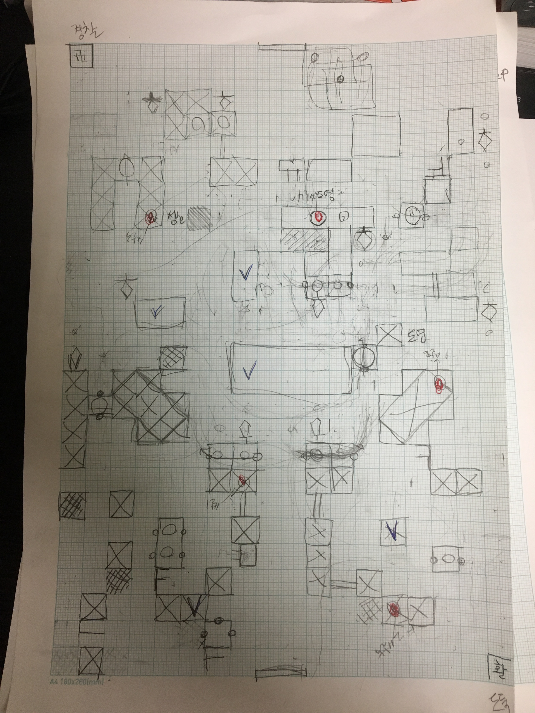
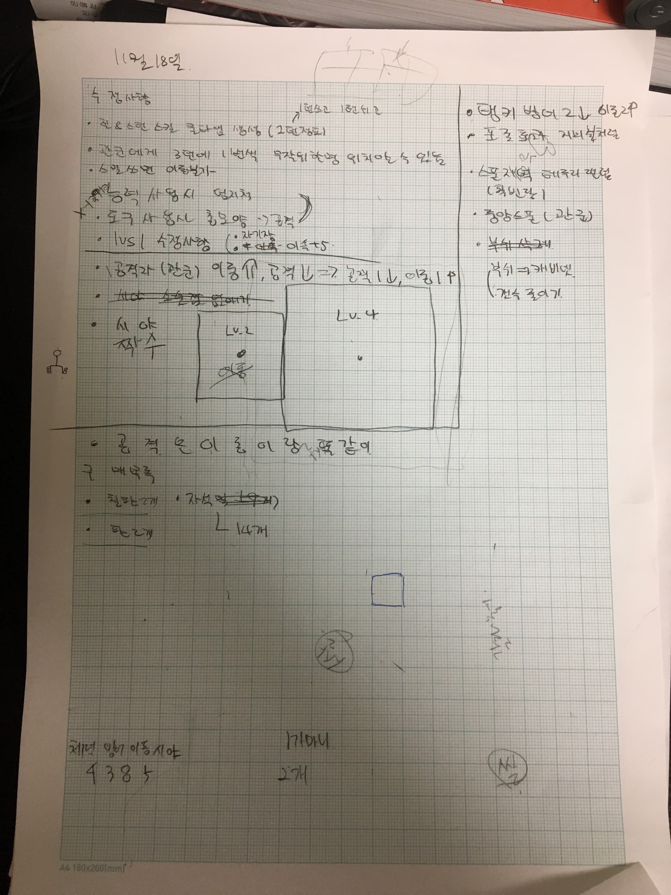

# 11월 18일 회의록

- 한판 플래이 후 문제점

  - 일반 활빈당이 한방으로 죽음..
  - 공격자 관군이 너무 쌤
  - 공격자 관군의 이동이 느림
  - 1vs1상황에서 절대적으로 관군이 유리해짐

- 한판 플래이 한 후 수정사항

  - 힐&스턴 스킬 사용시 쿨타임 생성(쓴다음 턴은 못쓴다.)
  - 관군은 3턴에 한번씩 무작위 한명의 위치를 알 수 있다.(관군의 불리한점 보충)
  - 보드게임 플래이시 스킬사용의 손동작
  - 1vs1상황(이동속도 +5 or 맵제한)
  - 관군 능력치 조정
    - 공격이 주인 관군
      - 이동 상향1
      - 공격 너프1
  - 시야 범위 애매한 점 수정
    - 스탯 2 일 경우 3x3
    - 스탯 4 일 경우 5x5
    - 시야 스탯은 짝수만 취급한다.
  - 공격 범위 수정
    - 공격 범위는 이동과 같이 상하좌우 스탯 당 한칸씩 취급
  - 활빈당 탱커 스탯 수정
    - 방어 2너프
    - 이동 2 버프
  - 포졸의 효과 수정
    - 피깍이는 방해물이 었으나, 수치상 표현하기 어려우므로, 이동거리를 줄이는 방향으로 수정됨
  - 스폰지역의 수정
    - 활빈당
      - 맵 태두리 랜덤
    - 관군
      - 중앙 스폰 랜덤
    - 부쉬 수정
      - 캐비넷으로 변경
      - 갯수 수정됨

- 준비 물품

  - 칠판1개(사회자용 맵구성)
  - 판2개(맵 그릴거)
  - 자석 약 14개(말, 장애물 표현)

- 맵 수정본

  

- 회의록

  