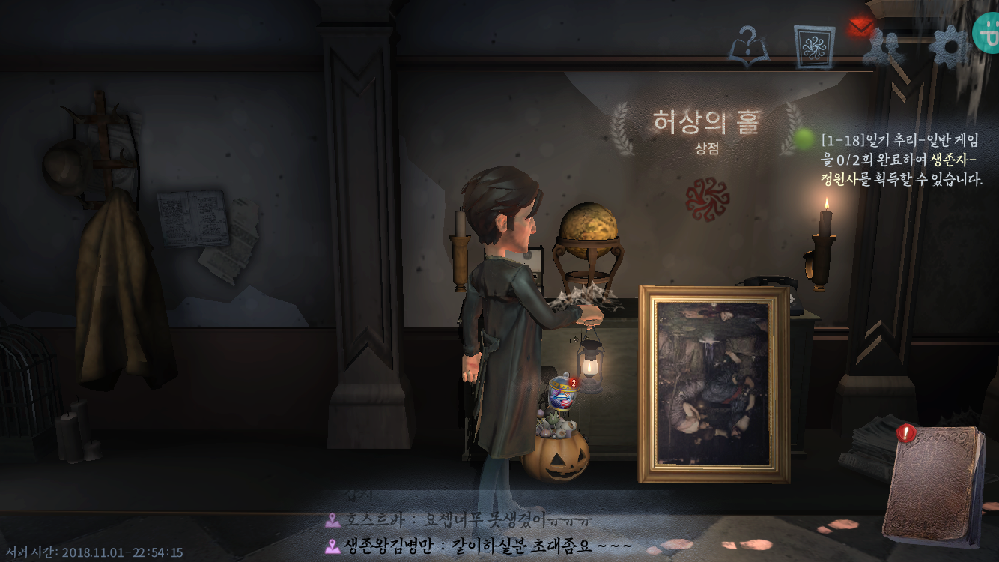
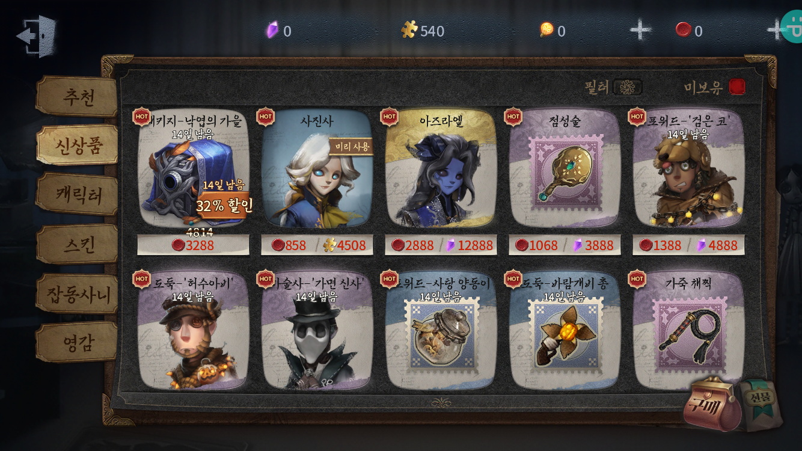
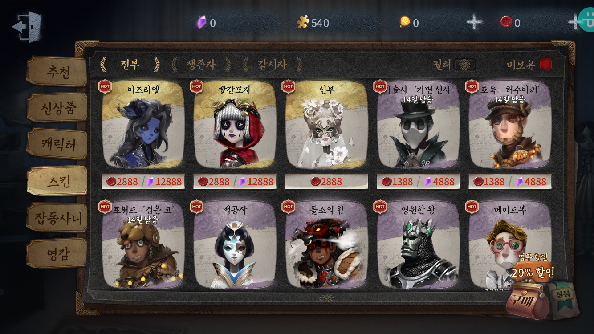
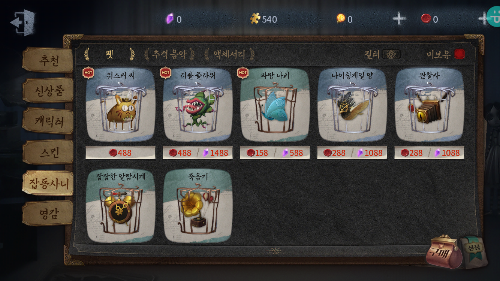
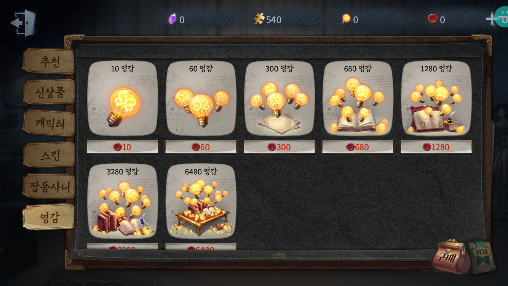
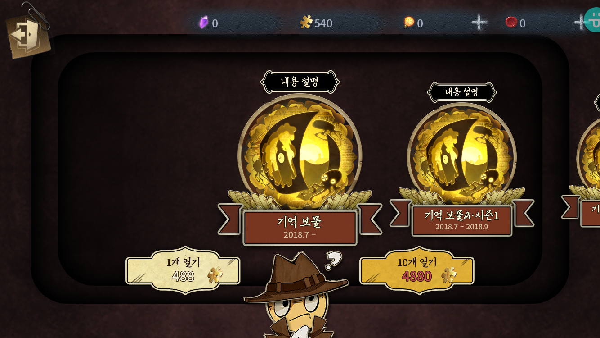

제 5인격 UI 역기획서

 ## 허상의 홀

> 아이탬 구매나 과금을 하는 메뉴

 

- 허상거래

  > 모은 퍼즐조각이나 메이리로 아이탬이나 캐릭터 구매 가능

  - 추천

    

  - 신상품

  - 

  - 캐릭터

    

    - 전부
    - 생존자
    - 감시자

  - 스킨

    

    - 생존자
    - 감시자

  - 잡동사니

    

    - 펫
    - 추격음악
    - 액세서리

  - 영감

    

    - 시즌 정수를 구매하는데 사용해야되는 것

- 보물교환

  

  - 모은 퍼즐로 보물을 교환하는 곳이며, 추리의 길 역기획서에 언급한 바와 같이 퍼즐조각으로 교환이 가능하다.

- 메아리 획득

  

  > 과금하는 메뉴이다.
