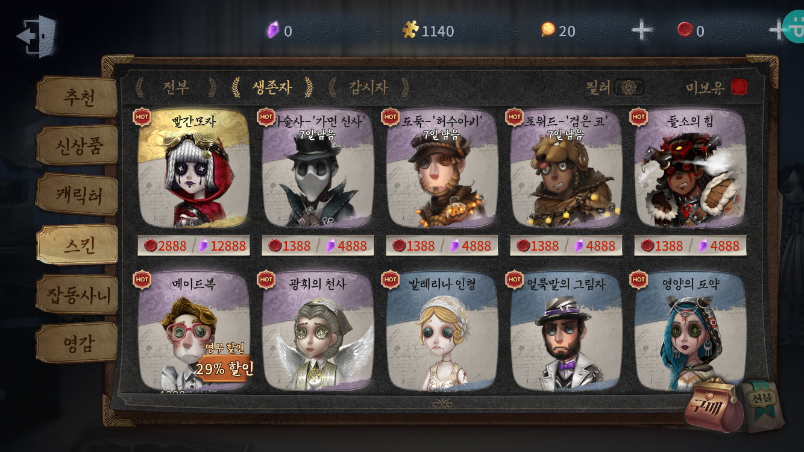

# 허상의 홀 허상거래 스킨 추가

>  이 게임의 주요 수입원으로 예상되는 스킨

- 전부

- 생존자(괄호는 생존자명)

  - 빨간모자(기계공)

  

  

  

  

  - 마술사-'가면 신사'(마술사)
  - 도둑-'허수아비'(도둑)
  - 포위드-'검은 코'(포위드)
  - 들소의 힘(포워드)
  - 메이드복(행운아)
  - 광휘의 천사(의사)
  - 발레리나 인형(무희)
  - 얼룩말의 그림자(마술사)
  - 영양의 도약(샤먼)
  - 기린의 우아함(조향사)
  - 용사(포워드)
  - 견습공(기계공)
  - 고생하는 시녀(고생하는 시녀)
  - 척후(도둑)
  - 귀족 예절(조향사)
  - 화동(정원사)
  - 고딕(기계공)
  - 황실기병대(공군)
  - 다크골드 케이크(맹인)
  - 천 겹 누더기(샤먼)
  - 무모한 젊은이(포위드)
  - 푸른 수염(도둑)
  - 부활(의사)
  - 용암 거북(포위드)
  - 클라운 피쉬(의사)
  - 블루샤크 노병(블루샤크 노병)
  - 마지막 바캉스(맹인)
  - 원양 항해(모험가)
  - 결혼식 사회자(마술사)
  - 소믈리에(변호사)
  - 표범무늬(의사)
  - 자객망토(용병)
  - 화가(도둑)
  - 아이보리(공군)
  - 하트핑크(정원사)
  - 살구색(모험가)
  - 자석영(도둑)
  - 레드가운(마술사)
  - 사파이어 블루(변호사)
  - 파이어 레드(용병)

- 감시자(괄호는 감시자 명)

  - 아즈라엘(사진사)
  - 신부(붉은 나비)
  - 백공작(붉은 나비)
  - 영원한 왕(공장장)
  - 백색 촉수(리퍼)
  - 재앙의 붉은 사슴(사냥터지기)
  - 심연의 노(로나 옷의 왕)
  - 녹색 촉수(리퍼)
  - 쥐가오리 항해사(리퍼)
  - 연회(노란 옷의 왕)
  - 안개 물수리(리퍼)
  - 죄수(광대)
  - 선홍(사냥터지기)
  - 빨간얼굴(광대)
  - 아이스블루(사냥터지기)
  - 호아동백작(리퍼)
  - 